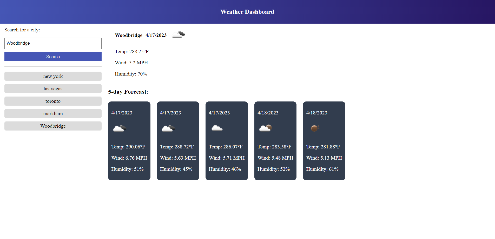

# Mordern Weather Dashboard

## Description

The Modern Weather Dashboard webapp is a digital platform that provides real-time information on weather conditions in a particular location. The app typically displays the temperature, precipitation, wind speed, and other meteorological data for the current time and the next few days.

The dashboard may also include a map that allows users to select a location and view weather conditions for that area. Users can customize the dashboard by selecting the units of measurement they prefer, such as Celsius or Fahrenheit, and may also have the option to choose between different weather models or data sources.

In addition to current weather data, the dashboard may also provide historical weather data, including average temperatures, precipitation amounts, and other climate-related information for a given location. This can be helpful for users who want to track weather patterns over time or plan future trips based on seasonal weather trends.

Overall, the Modern Weather Dashboard webapp is a convenient tool for anyone who wants to stay informed about current and upcoming weather conditions in a specific location. It provides easy-to-read data in a visually appealing format, making it easy for users to quickly assess weather conditions and plan their day accordingly.

## Table of contents

- [Installation](#installation)
- [Usage](#usage)
- [Screenshot](#screenshot)
- [Video](#video)
- [Contribution](#contribution)
- [Questions](#questions)
- [License](#license)

## Installation

Follow the link of the deployed application [Mordern Weather Dashboard](https://aleksandrbausher.github.io/Mordern-Weather-Dashboard/) ,

Otherwise clone GitHub repository [Mordern Weather Dashboard](https://github.com/AleksandrBausher/Mordern-Weather-Dashboard)

And get your apikey from the [Open Weather Map](https://openweathermap.org/forecast5)

## Usage
Click here to access my [Mordern Weather Dashboard](https://aleksandrbausher.github.io/Mordern-Weather-Dashboard/), 
To know more about me and my projects

## Screenshot

## Video
You can go through the [Demonstration Video](https://drive.google.com/file/d/14Z7YvYXNk26N9ZY2Z9oKWjbKyt9pxG9c/view?usp=sharing)

## Contribution

Application was created by Aleksandr Bausher and if you want to contribute send me email.

## Questions

My Email:
[aleksandrbausher@gmail.com](mailto:aleksandrbausher@gmail.com)
My Github:
[AleksandrBausher](https://github.com/aleksandrbausher)

## License

